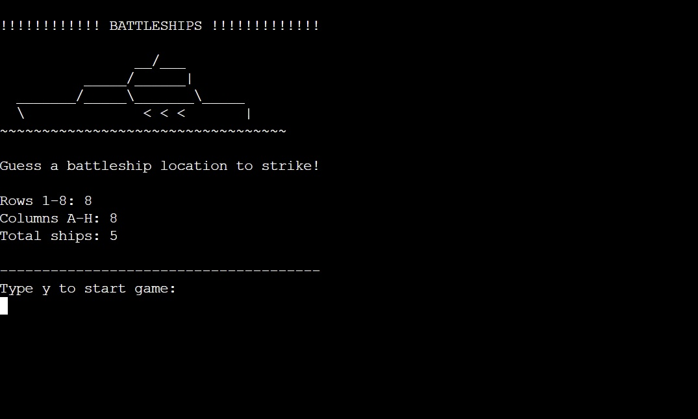
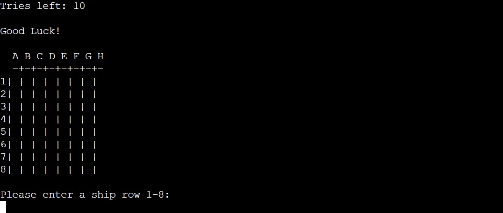
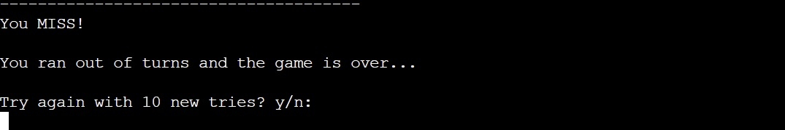

# Battleships

## A Python text-based battleships game
> This is a single-player battleships game, initially the player gets 10 tries to hit all 5 ships.
> If the player hits all 5, congratulations!
> If not, you get the opportunity to try again with another 10 tries.

### - By Rasmus Persson

### [Live Site](https://my-battleship-game1.herokuapp.com/)

### [Repository](https://github.com/Mysanthropium/Battleships)

## Table of contents

1. [Game Flow](#Game-Flow)
2. [Implemented Features](#Implemented-Features)
3. [How to play](#How-to-play)
4. [Features left to implement](#Features-left-to-implement)
5. [Technology Used](#Technology-Used)
6. [Testing](#Testing)
7. [Deployment](#Deployment)
8. [Credits](#Credits)
9. [Contents and resources](#Contents-and-resources)
10. [Acknowledgements](#Acknowledgements)

## Game Flow
> When the game is run, the user is presented with a starting screen:

> When the user has typed 'y' the game starts:

> The user gets to choose row and column, when they miss:

> When the user hits:

> The user will also be able to track their tries left after each turn:

> When the user run out of tries they get this message:

> When the user hits all 5 battleships, gets message:

### Implemented Features
* The user is able to start over with 10 more tries in the same game.

### How to play

### Features left to implement

## Technology Used

## Testing

## Deployment

## Credits

## Contents and resources

## Acknowledgements

[Back to Top of page](#battleships)

