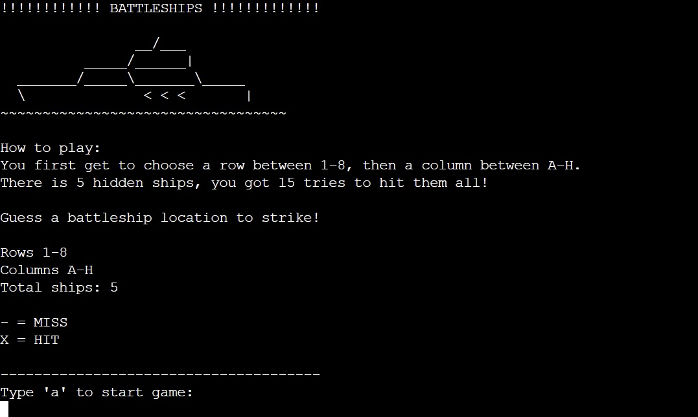
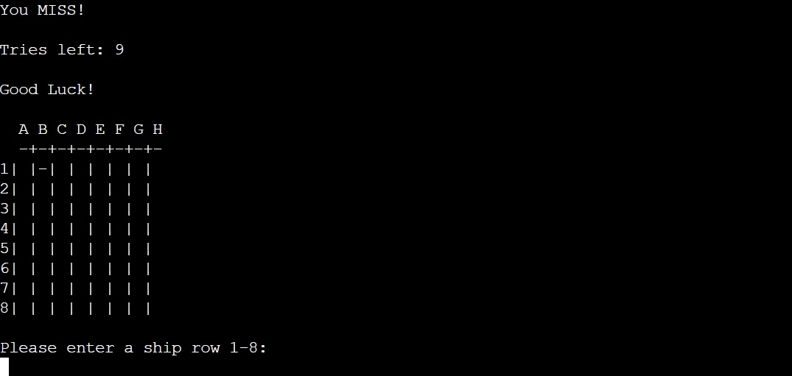
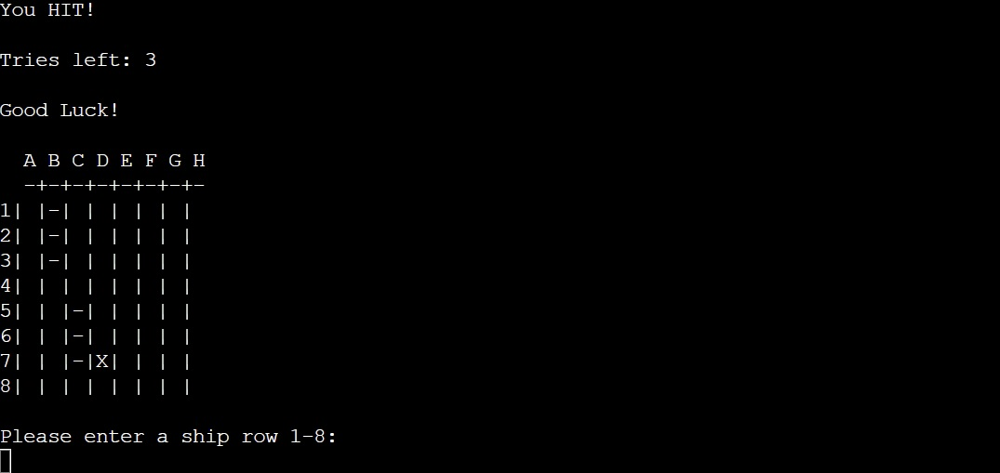
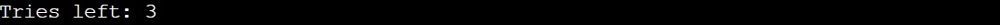
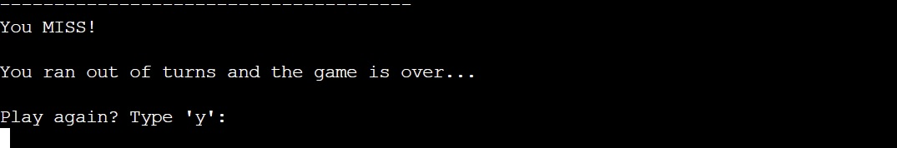
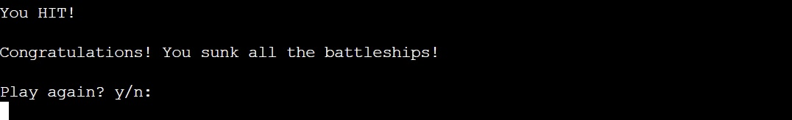
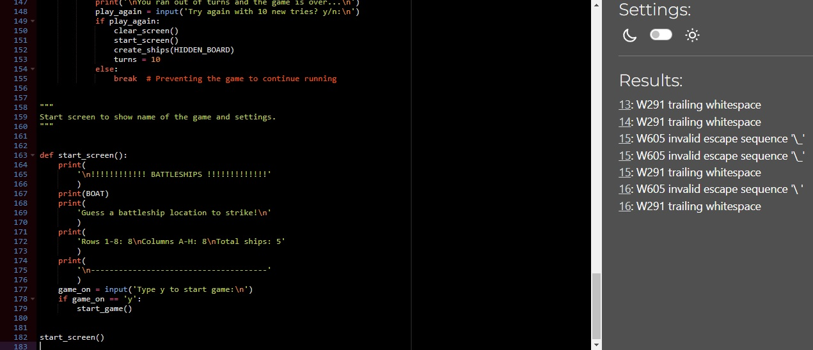

# Battleships

## A Python text-based battleships game
> This is a single-player battleships game, initially the player gets 15 tries to hit all 5 ships.
> If the player hits all 5, congratulations!
> If not, you get the opportunity to try again.

### - By Rasmus Persson

### [Live Site](https://my-battleship-game1.herokuapp.com/)

### [Repository](https://github.com/Mysanthropium/Battleships)

## Table of contents

1. [Game Flow](#Game-Flow)
2. [Implemented Features](#Implemented-Features)
3. [How to play](#How-to-play)
4. [Features left to implement](#Features-left-to-implement)
5. [Technology Used](#Technology-Used)
6. [Testing](#Testing)
7. [Deployment](#Deployment)
8. [Credits](#Credits)
9. [Contents and resources](#Contents-and-resources)
10. [Acknowledgements](#Acknowledgements)

## Game Flow
> When the game is run, the user is presented with a starting screen:

> When the user has typed 'a' the game starts:

> The user gets to choose row and column. And when they miss:

> When the user hits:

> The user will also be able to track their tries left after each turn:

> When the user run out of tries they get this message:

> When the user hits all 5 battleships, gets message:

### Implemented Features
* The user is able to play again at the end of the game.
* The user will be told if they enter wrong characters in row and column.

### How to play
1. Choose wether or not you want to play enter 'a'.
2. Choose a row between 1-8.
3. Choose a column between A-H.
4. Try to hit all 5 battleships on the board within 15 tries.
5. At the end of game you get to choose if you want to play again.

### Features left to implement
* Let the player choose a grid size and number of ships.
* Play against the computer.
* Add different ship sizes.
* Let the player place their own ships.

## Technology Used
### Python
* To create the application

### Heroku
* For deployment and hosting of the application

### GitHub
* Used to store code

### Gitpod
* The IDE of choice for the application

### Git
* Used for version control

### Modules used
* 'random' was used to randomize ship placements.
* 'sys and os' was used to clear terminal.

## Testing
* The code is tested using [PEP8](https://pep8ci.herokuapp.com/)
   * With the only warnings being in the ascii art boat image.

### Bugs and issues
* There's an issue in the ascii art, resulting in warnings in PEP8.
* Found an error when pressing 'Enter' when asked for column.

## Deployment
### Version Control
Using GitPod to push code to main repository in GitHub.
* In GitPod terminal use "git add ." to add the changes.
* Then use "git commit -m "push comment"" to make a comment to your push.
* Finally use "git push" to push the update to the repository on GitHub.

### App deployment
Using Heroku for app deployment.
* Create a new app on your dashboard.
* Navigate to "Settings" in your new app.
* Using the "Config Vars" add PORT to KEY, and 8000 to its VALUE.
* Install the buildpacks needed for this project. In this order!
   * Python
   * node.js
* Then navigate to deploy section and choose GitHub.
* Connect to your GitHub repository by searching for your repository name.
* Using "automatic" deployment, deploys your commits to Heroku.
* Now we can click the "App" button in the top right corner to run our application.

## Credits
### [YouTube](https://www.youtube.com/)
* For having great learning content.

### [Python](python.org)
* For beginner friendly tutorials.

### [GitHub](docs.github.com)
* For learning how to document a nice looking readme.

## Contents and resources
### [YouTube](https://www.youtube.com/)
* Can't show YouTube enough appreciation.

### [ASCII Art](https://www.asciiart.eu/)
* For creating my boat art.

### Knowledge Mavens
* Used [this](https://github.com/gbrough/battleship/blob/main/single_player.py) repository to build the functions in the game.

### Code Institute
* This project is a part of the course content.

## Acknowledgements
### Alan Bushell
* My cohort fascilitator being very helpful every week at our weekly standup meeting.

### Adeye Adegbenga
* My mentor at Code Institute, giving me good and helpful feedback.

[Back to Top of page](#battleships)

